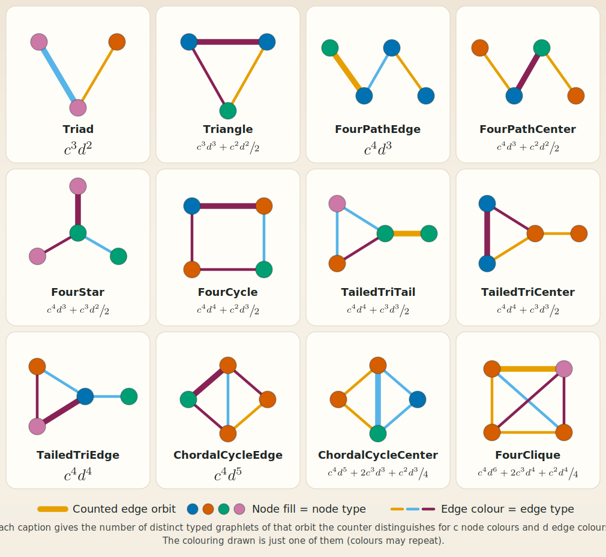

# Heterogeneous Graphlets

Rust implementation of heterogeneous (typed) graphlet counting, after Rossi et al., "Heterogeneous Graphlets" (ACM TKDD 2020).

## Heterogeneous (coloured) graphlets

A graphlet is a small connected subgraph. A *heterogeneous* graphlet additionally gives every node a **colour** (its type). For each edge of the graph, this crate counts the 4-node graphlet orbits the edge participates in, separately for **every combination of node colours**. There are twelve edge orbits, distinguished by where the counted edge sits inside the graphlet:

Each node is filled with its colour, and the bold edge is the one being counted. The colouring drawn in each panel is only *one example*: the same orbit with a different colouring (colours may repeat) is a different heterogeneous graphlet, counted separately.

That is the whole point of the crate, and it is why a single topology stands for many counts. The caption under each panel gives, for $c$ node colours, the number of distinct typed graphlets of that orbit the counter distinguishes (its edge-centric hash granularity). These fall into three cases:

- Triad, Triangle: $c^{3}$
- FourPathEdge, TailedTriCenter: $c^{4}$
- the remaining eight: $\dfrac{c^{3}(c+1)}{2}$

(So a 4-clique edge, for example, has $\frac{c^3(c+1)}{2} = 160$ distinct typed forms at $c = 4$.) These counts are verified exhaustively by the test suite.

## Number of node colours supported

Each typed graphlet is stored under a perfect hash of `(orbit kind, the four node colours)` in base $c + 1$, using the integer type you pick as the `Graphlet` key (the first type parameter of `HeterogeneousGraphlets`). The number of colours $c$ you can use is the largest value satisfying

$$13\,(c+1)^4 + (c+1)^3 + (c+1)^2 + (c+1) \;\le\; G_{\max},$$

where $G_{\max}$ is the maximum value of the chosen `Graphlet` type. The crate checks this bound on every call and **panics rather than miscounting** if it is exceeded, so pick a key type wide enough for your colour count:

| `Graphlet` key | maximum node colours |
| --- | ---: |
| `u8`   | 1 |
| `u16`  | 7 |
| `u32`  | 133 |
| `u64`  | 34,512 |
| `u128` | 2,261,903,241 |

(Cora has 7 node colours and CiteSeer 6, which is why both fit `u16`.) A second, usually looser, cap comes from the range of the `NodeLabel` type itself.

## Usage

See the [crate documentation](https://docs.rs/heterogeneous_graphlets) for a complete, runnable example: implement `Graph` and `TypedGraph` for your graph type, opt into `HeterogeneousGraphlets` by choosing the hash-key and count integer types, and call `get_heterogeneous_graphlet(src, dst)` on an edge.
